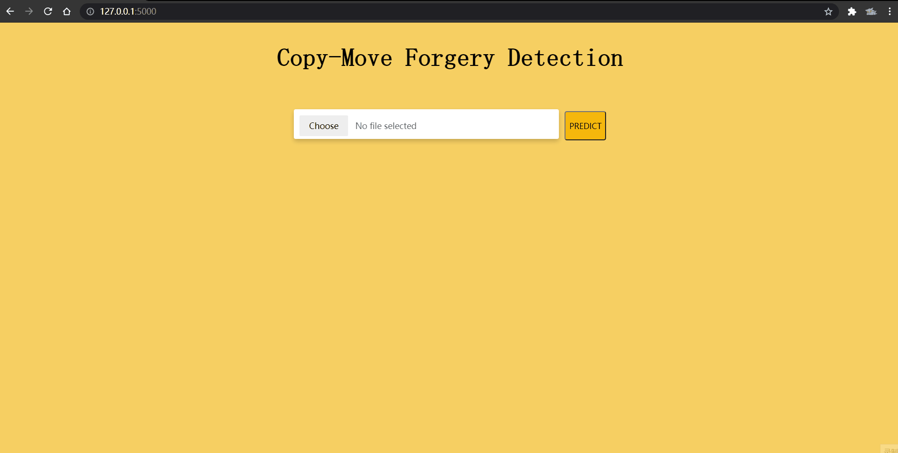

# Deep Learning Based CMFD Application

## Intro

The popularization of portable digital devices has produced a large number of digital images in the world, and various Internet social platforms have expanded the ways of image dissemination, and digital images have been fully integrated into people's lives. The resulting problem is that various types of image processing software have also been developed,  making it easy for ordinary users to perform various editing and modification operations on any digital image. Fake pictures will have a bad influence on society and the country.

**Copy-Move forgery refers to copying a certain area of an image, moving and pasting it to other locations of the same image, so as to achieve the effect of difficult to distinguish between true and false.**

## Overview

- Constructed an end-to-end image tampering detection DNN model in Keras which supports discerning and localizing source/target regions. 
- Built a interactive Flask web application to deploy this model for testing copy-move manipulation.
- Evaluated on CASIA V2 dataset with a recall of 82.8% and F1 score of 81.8% at image-level.

## Demo

